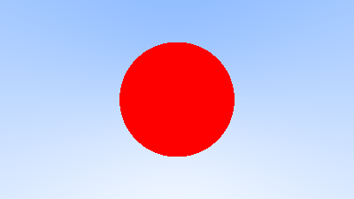

# Ray Tracer

This is a **lightweight, embeddable ray tracer** written in C++. It's currently in **early development** and not yet ready for production use.

The ray tracer currently outputs images in the **Netpbm format**, with future plans to explore **real-time ray tracing using DirectX 12**.

## Renders

A non-shaded sphere:

Simple sky gradiant:

My first render:

